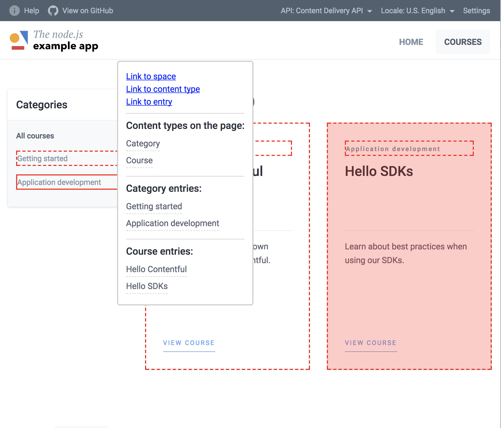

# The node.js example app

This is a fork of [the example app in Node.js](https://github.com/contentful/the-example-app.nodejs).

However, this project is aimed only to one thing – integrate with [contentful-wizard](https://github.com/Bloomca/contentful-wizard), which allows you to add interactive tooltips to all contentful-powered blocks.

> [live demo](https://contentful-wizard-tea.bloomca.me)  |  [integration commit](https://github.com/Bloomca/the-example-app.nodejs/commit/f4932887b6a1cc7a91072e54589a81c48e06d1f1)

